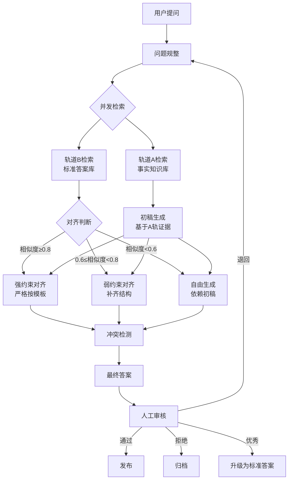

# IR_RAG - 医药 IR 双轨 RAG 问答审核系统

> 🏥 专业的医药公司投资者关系（IR）问答系统，采用双轨 RAG 架构，确保答案的准确性和合规性

[](https://fastapi.tiangolo.com/)
[](https://vuejs.org/)
[](https://streamlit.io/)
[](https://www.mysql.com/)

---

## 📋 目录

- [项目简介](#项目简介)
- [核心特性](#核心特性)
- [技术架构](#技术架构)
- [快速开始](#快速开始)
- [双轨 RAG 工作流程](#双轨-rag-工作流程)
- [目录结构](#目录结构)
- [API 文档](#api-文档)
- [数据库设计](#数据库设计)
- [配置说明](#配置说明)
- [已知问题与修复](#已知问题与修复)
- [开发指南](#开发指南)
- [Roadmap](#roadmap)

---

## 🎯 项目简介

IR_RAG 是为医药公司投资者关系部门设计的智能问答系统，采用创新的"双轨 RAG"架构：

- **轨道 A（事实知识轨）**：公司公告、研报、FAQ、政策披露等事实性知识，用于生成初稿
- **轨道 B（标准答案轨）**：版本化标准回答库，支持强/弱约束配置，用于对齐与合规校验

### 核心价值

1. **准确性** - 基于真实公司文档生成答案
2. **一致性** - 通过标准答案库确保口径统一
3. **合规性** - 冲突检测和约束机制确保合规
4. **可追溯** - 完整的审计日志和证据链
5. **可扩展** - 模块化设计，易于定制和扩展

---

## ✨ 核心特性

### 1. 双轨 RAG 问答
- ✅ 并发检索轨道 A 和轨道 B
- ✅ 智能对齐：强约束/弱约束/自由模式
- ✅ 冲突检测（免责声明、术语一致性等）
- ✅ 证据来源追溯

### 2. 审核工作台
- ✅ 任务列表与状态过滤
- ✅ 初稿与对齐后答案对比
- ✅ 一键审核：通过/退回/拒绝
- ✅ 优秀回答升级为标准答案

### 3. 文档管理
- ✅ 批量上传（ZIP/CSV/Excel）
- ✅ 自动解析和向量化
- ✅ 分类管理（公告/研报/FAQ等）
- ✅ 批次状态追踪

### 4. 标准答案库
- ✅ 版本化管理
- ✅ 强/弱约束配置
- ✅ 时间窗口控制
- ✅ 一键 Promote

### 5. Prompt 模板
- ✅ 模板版本化
- ✅ 启用/禁用控制
- ✅ 审计日志

### 6. 双前端支持
- 🎨 **Vue3 + Element Plus** - 完整管理界面
- 🚀 **Streamlit** - 专注审核工作流，更直观高效

---

## 🏗️ 技术架构

### 后端技术栈
```
FastAPI 0.115          # 现代化异步 Web 框架
SQLAlchemy 2.0         # ORM (异步模式)
Alembic 1.13           # 数据库迁移
MySQL 8.4              # 关系数据库
httpx 0.27             # 异步 HTTP 客户端
Loguru 0.7             # 日志系统
Pandas 2.2             # 数据处理
Tenacity 9.0           # 重试机制
```

### 前端技术栈
```
Vue3 3.5               # 渐进式框架
Element Plus 2.8       # UI 组件库
Streamlit 1.39         # 快速 UI 开发
Axios 1.7              # HTTP 客户端
Vite 5.4               # 构建工具
```

### 外部服务
```
RAGFlow v0.21.0        # 向量检索与文档解析
Qwen-max               # 大语言模型（通义千问）
DeepSeek (可选)        # 备选 LLM
```

### 架构图
```
┌─────────────────────────────────────────────────────────────┐
│                        前端层                                 │
│  ┌──────────────┐              ┌──────────────┐             │
│  │   Vue3 UI    │              │  Streamlit   │             │
│  │ (管理控制台)  │              │  (审核工作台) │             │
│  └──────────────┘              └──────────────┘             │
└────────────┬────────────────────────┬────────────────────────┘
             │                        │
             └────────────┬───────────┘
                          ↓
┌─────────────────────────────────────────────────────────────┐
│                    FastAPI 后端                              │
│  ┌──────────────────────────────────────────────────────┐  │
│  │  API Layer (endpoints/)                               │  │
│  │  qa.py │ reviews.py │ imports.py │ prompts.py │ ...  │  │
│  └────────────────────┬─────────────────────────────────┘  │
│                       ↓                                      │
│  ┌──────────────────────────────────────────────────────┐  │
│  │  Service Layer (services/)                            │  │
│  │  • rag_pipeline.py  - 双轨RAG编排                    │  │
│  │  • ingest.py        - 文档导入与上传                 │  │
│  │  • batch_processor  - 批量处理                       │  │
│  └────────────────────┬─────────────────────────────────┘  │
│                       ↓                                      │
│  ┌──────────────────────────────────────────────────────┐  │
│  │  Client Layer (clients/)                              │  │
│  │  • ragflow_client.py  - RAGFlow API 封装             │  │
│  │  • llm_client.py      - LLM 统一客户端               │  │
│  └──────────────────────────────────────────────────────┘  │
└───────────┬──────────────────────┬──────────────────────────┘
            ↓                      ↓
┌──────────────────┐    ┌──────────────────────┐
│   MySQL 8.4      │    │  RAGFlow v0.21.0     │
│  • 结构化数据     │    │  • 向量检索          │
│  • 元数据管理     │    │  • 文档解析          │
│  • 审计日志       │    │  • Embedding         │
└──────────────────┘    └──────────────────────┘
                                  ↓
                        ┌──────────────────────┐
                        │   Qwen-max LLM      │
                        │  (通义千问最强模型)  │
                        └──────────────────────┘
```

---

## 🚀 快速开始

### 前置要求

- Docker Desktop (支持 Docker Compose)
- 至少 4GB 可用内存
- 已运行的 RAGFlow 实例

### 1. 克隆项目

```bash
git clone <repository-url>
cd IR_RAG
```

### 2. 配置环境变量

编辑 `docker-compose.yml`，填入必要的配置：

```yaml
environment:
  # 数据库配置
  - MYSQL_USER=ir
  - MYSQL_PASSWORD=ir_password
  
  # RAGFlow 配置
  - RAGFLOW_BASE_URL=http://host.docker.internal:9380
  - RAGFLOW_API_KEY=ragflow-YOUR_API_KEY
  
  # LLM 配置
  - QWEN_API_KEY=sk-YOUR_QWEN_API_KEY
  - LLM_PROVIDER=qwen
  - LLM_MODEL=qwen-max
```

### 3. 启动服务

```bash
# 构建并启动所有服务
docker compose build
docker compose up -d

# 查看服务状态
docker compose ps

# 查看日志
docker compose logs -f backend
```

### 4. 访问应用

| 服务 | 地址 | 说明 |
|------|------|------|
| **Streamlit 审核系统** | http://localhost:8501 | ⭐ 推荐，专注审核工作流 |
| Vue3 管理控制台 | http://localhost:5173 | 完整管理功能 |
| 后端 API 文档 | http://localhost:8000/docs | Swagger UI |
| 数据库管理 | http://localhost:8080 | Adminer |

### 5. 初始化数据

```bash
# 方式 1：通过 Streamlit 界面
访问 http://localhost:8501
进入"标准回答管理"模块，创建初始标准答案

# 方式 2：通过 API
curl -X POST http://localhost:8000/api/v1/standards/promote \
  -H "Content-Type: application/json" \
  -d '{
    "topic_key": "example_topic",
    "content": "这是一个标准答案示例",
    "strong_constraint": false
  }'
```

---

## 🔄 双轨 RAG 工作流程

### 问答生成流程



### 对齐机制详解

| 相似度范围 | 模式 | 行为 | 适用场景 |
|-----------|------|------|---------|
| ≥ 0.8 | 🔒 强约束 | 严格按标准模板对齐，措辞一字不差 | 法律声明、财务数据披露 |
| 0.6 ~ 0.8 | 🔓 弱约束 | 保留事实内容，按模板补齐结构 | 研发进展、业务更新 |
| < 0.6 | 🆓 自由 | 基于轨道A初稿，不做强制对齐 | 开放性问题、创新场景 |

---

## 📁 目录结构

```
IR_RAG/
├── backend/                      # FastAPI 后端
│   ├── app/
│   │   ├── api/v1/endpoints/    # API 端点
│   │   │   ├── health.py        # 健康检查
│   │   │   ├── qa.py            # ⭐ 单问即答
│   │   │   ├── reviews.py       # ⭐ 审核工作台
│   │   │   ├── imports.py       # 批量导入
│   │   │   ├── standards.py     # 标准答案管理
│   │   │   ├── prompts.py       # Prompt 模板
│   │   │   ├── audit.py         # 审计日志
│   │   │   └── metrics.py       # 系统指标
│   │   ├── clients/             # 外部服务客户端
│   │   │   ├── ragflow_client.py   # ⭐ RAGFlow v0.21.0 集成
│   │   │   └── llm_client.py       # ⭐ 通用 LLM 客户端（Qwen/DeepSeek/OpenAI）
│   │   ├── core/
│   │   │   ├── config.py        # ⭐ 配置管理
│   │   │   └── logging.py       # 日志配置
│   │   ├── db/
│   │   │   └── session.py       # 数据库会话
│   │   ├── models/
│   │   │   ├── enums.py         # 枚举定义
│   │   │   └── models.py        # ⭐ ORM 模型
│   │   ├── services/
│   │   │   ├── rag_pipeline.py  # ⭐ 双轨 RAG 核心逻辑
│   │   │   ├── ingest.py        # ⭐ 文档导入服务
│   │   │   └── batch_processor.py # 批量处理
│   │   └── main.py              # FastAPI 应用入口
│   ├── alembic/                 # 数据库迁移
│   │   └── versions/
│   │       └── 20251020_0001_init.py  # 初始迁移
│   ├── Dockerfile
│   ├── entrypoint.sh            # 容器启动脚本
│   └── requirements.txt
│
├── frontend/                    # Vue3 前端
│   ├── src/
│   │   ├── views/              # 页面组件
│   │   │   ├── QAView.vue      # 单问即答
│   │   │   ├── ReviewsView.vue # 审核工作台
│   │   │   ├── ImportsView.vue # 批量导入
│   │   │   ├── StandardsView.vue # 标准答案
│   │   │   └── PromptsView.vue # Prompt 管理
│   │   ├── api.ts              # API 客户端
│   │   ├── App.vue
│   │   └── main.ts
│   ├── nginx.conf              # ⭐ 自定义 Nginx 配置（支持 500MB 文件上传）
│   ├── Dockerfile
│   └── package.json
│
├── streamlit_app/              # ⭐ Streamlit 审核系统（新增）
│   ├── app.py                  # 主应用（5个功能模块）
│   ├── Dockerfile
│   ├── requirements.txt
│   └── README.md
│
├── samples/
│   └── import_templates/       # CSV 导入模板
│       ├── knowledge_a.csv
│       ├── standards_b.csv
│       └── questions.csv
│
├── docker-compose.yml          # ⭐ 服务编排
└── README.md                   # 本文件
```

---

## 📡 API 文档

### 核心 API 端点

#### 1. 单问即答
```http
POST /api/v1/qa/answer
Content-Type: application/json

{
  "question": "公司最新的研发管线进展如何？",
  "prompt": "请简洁专业地回答",
  "kb_a_id": "9d836ce6ae7c11f08b543a9883fcddc0",
  "kb_b_id": "9d836ce6ae7c11f08b543a9883fcddc0",
  "top_k_a": 5,
  "top_k_b": 5
}
```

**返回**：
  ```json
{
  "initial": "基于A轨的初稿...",
  "aligned": "对齐后的答案...",
  "evidence_a": {
    "chunks": [
      {"text": "...", "score": 0.85, "metadata": {...}}
    ]
  },
  "evidence_b": {...},
  "alignment": {
    "mode": "weak",
    "max_score": 0.72,
    "conflicts": []
  }
}
```

#### 2. 批量导入知识库A

**纯 ZIP 模式**（最简单，推荐）：
```http
POST /api/v1/imports/knowledge-a-zip?kb_a_id={dataset_id}&default_category=announcement
Content-Type: multipart/form-data

file: <ZIP文件，包含PDF/DOCX>
```

**混合模式**（最完整）：
```http
POST /api/v1/imports/knowledge-a-hybrid?kb_a_id={dataset_id}
Content-Type: multipart/form-data

csv_file: <CSV元数据文件>
zip_file: <ZIP文件包>
```

#### 3. 审核工作台

**获取任务列表**：
```http
GET /api/v1/reviews?status=pending
```

**审核操作**：
```http
POST /api/v1/reviews/{task_id}/approve
POST /api/v1/reviews/{task_id}/request_changes
POST /api/v1/reviews/{task_id}/reject

Body: {"comments": "审核意见"}
```

#### 4. 标准答案管理

```http
POST /api/v1/standards/promote
Content-Type: application/json

{
  "topic_key": "rd_pipeline_update",
  "content": "标准答案内容...",
  "strong_constraint": false,
  "description": "研发管线更新标准回复"
}
```

完整 API 文档：访问 http://localhost:8000/docs

---

## 🗄️ 数据库设计

### 核心表结构

```sql
-- 用户表
users (id, email, name, role, is_active, created_at)

-- Prompt 模板（版本化）
prompt_templates (id, name, version, content, is_active, created_at)

-- 导入批次
import_batches (id, type, status, file_path, meta_data, created_by_id, created_at)

-- 轨道A：知识文档
knowledge_docs (
  id, title, category, source_path, source_url, 
  disclosure_date, batch_id, meta_data, created_at
)

-- 轨道B：标准答案（主表）
standard_answers (id, topic_key, description, created_at)

-- 轨道B：标准答案版本
standard_answer_versions (
  id, standard_answer_id, version, content, 
  strong_constraint, effective_from, effective_to, 
  meta_data, created_at
)

-- 问题表
questions (
  id, asked_text, normalized_text, 
  prompt_template_id, status, meta_data, created_at
)

-- 生成的答案
generated_answers (
  id, question_id, initial_answer, aligned_answer,
  alignment_summary, sources_a, sources_b, created_at
)

-- 审核任务
review_tasks (
  id, question_id, generated_answer_id, status,
  assignee_id, comments, created_at, updated_at
)

-- 审计日志
audit_logs (id, user_id, action, details, created_at)
```

### 重要说明

⚠️ **字段名修改**：所有模型中的 `metadata` 字段已改为 `meta_data`，因为 `metadata` 是 SQLAlchemy 的保留字。

---

## ⚙️ 配置说明

### 环境变量（docker-compose.yml）

```yaml
# MySQL 数据库
MYSQL_USER=ir
MYSQL_PASSWORD=ir_password
MYSQL_HOST=mysql
MYSQL_PORT=3306
MYSQL_DB=ir_rag

# RAGFlow 向量检索
RAGFLOW_BASE_URL=http://host.docker.internal:9380  # API 端口
RAGFLOW_API_KEY=ragflow-xxxxx                      # 从 RAGFlow 界面获取

# LLM 配置
QWEN_API_KEY=sk-xxxxx                              # 阿里云 DashScope API Key
LLM_PROVIDER=qwen                                  # qwen | deepseek | openai
LLM_MODEL=qwen-max                                 # 模型名称

# 对齐阈值（可选，有默认值）
ALIGNMENT_STRONG_THRESHOLD=0.8                     # 强约束阈值
ALIGNMENT_WEAK_THRESHOLD=0.6                       # 弱约束阈值

# 其他
STORAGE_BASE_DIR=/app/storage
CORS_ALLOW_ORIGINS=["*"]
```

### 获取 API Keys

**RAGFlow API Key**：
1. 访问 RAGFlow Web 界面（http://localhost:80）
2. 登录后进入 Settings → API Keys
3. 创建新的 API Key

**Qwen API Key**：
1. 访问 https://dashscope.console.aliyun.com/
2. 登录阿里云账号
3. 进入 API Key 管理页面
4. 创建或复制 API Key

---

## 🐛 已知问题与修复

### 问题 1：前端构建失败 - `npm ci` 错误
**原因**：缺少 `package-lock.json`  
**修复**：已在 `frontend/Dockerfile` 中添加条件安装
```dockerfile
RUN if [ -f package-lock.json ]; then npm ci; else npm install; fi
```

### 问题 2：后端构建内存不足
**原因**：`apt-get` 安装过多系统包  
**修复**：已移除不必要的系统包安装

### 问题 3：entrypoint.sh 执行失败
**原因**：Windows CRLF 换行符  
**修复**：已在 Dockerfile 中添加换行符转换
```dockerfile
RUN sed -i 's/\r$//' /entrypoint.sh && chmod +x /entrypoint.sh
```

### 问题 4：SQLAlchemy 字段名冲突
**原因**：`metadata` 是 SQLAlchemy 保留字  
**修复**：所有模型中 `metadata` 字段改为 `meta_data`，包括：
- `backend/app/models/models.py`
- `backend/alembic/versions/20251020_0001_init.py`
- `backend/app/services/ingest.py`
- `backend/app/api/v1/endpoints/imports.py`

### 问题 5：文件上传 413 错误
**原因**：Nginx 默认 1MB 限制  
**修复**：创建自定义 `frontend/nginx.conf`，设置：
```nginx
client_max_body_size 500M;
```

### 问题 6：数据库迁移失败
**原因**：缺少 `cryptography` 包  
**修复**：已添加到 `requirements.txt`
```
cryptography==43.0.3
```

### 问题 7：RAGFlow 文档停留在 Pending
**原因**：上传后需要主动触发解析  
**修复**：在 `ragflow_client.py` 中添加自动触发解析
```python
async def parse_document(self, kb_id: str, doc_id: str):
    """POST /api/v1/datasets/{dataset_id}/chunks"""
    payload = {"document_ids": [doc_id]}
    resp = await self._client.post(f"/api/v1/datasets/{kb_id}/chunks", json=payload)
```

### 问题 8：Docker 健康检查失败
**原因**：容器中缺少 `wget`  
**影响**：仅显示 unhealthy 标记，不影响实际功能  
**状态**：可忽略，服务运行正常

---

## 👨‍💻 开发指南

### 本地开发

#### 后端开发
```bash
cd backend

# 创建虚拟环境
python -m venv venv
source venv/bin/activate  # Windows: venv\Scripts\activate

# 安装依赖
pip install -r requirements.txt

# 运行开发服务器
uvicorn app.main:app --reload --host 0.0.0.0 --port 8000
```

#### 前端开发
```bash
cd frontend

# 安装依赖
npm install

# 运行开发服务器
npm run dev
```

#### Streamlit 开发
```bash
cd streamlit_app

# 安装依赖
pip install -r requirements.txt

# 设置环境变量
export BACKEND_API_URL=http://localhost:8000

# 运行
streamlit run app.py
```

### 数据库迁移

```bash
# 进入后端容器
docker exec -it irrag-backend bash

# 创建新迁移
alembic revision -m "description"

# 执行迁移
alembic upgrade head

# 回滚迁移
alembic downgrade -1
```

### 添加新功能

#### 1. 添加新的 API 端点

```python
# backend/app/api/v1/endpoints/my_feature.py
from fastapi import APIRouter

router = APIRouter(prefix="/my-feature", tags=["my-feature"])

@router.get("/")
async def my_endpoint():
    return {"message": "Hello"}
```

```python
# backend/app/api/v1/routes.py
from app.api.v1.endpoints import my_feature

api_router.include_router(my_feature.router)
```

#### 2. 添加新的数据模型

```python
# backend/app/models/models.py
class MyModel(Base):
    __tablename__ = "my_table"
    id: Mapped[int] = mapped_column(primary_key=True)
    name: Mapped[str] = mapped_column(String(100))
```

```bash
# 创建迁移
alembic revision --autogenerate -m "add my_table"
alembic upgrade head
```

### 调试技巧

```bash
# 查看所有服务日志
docker compose logs -f

# 查看特定服务日志
docker compose logs -f backend
docker compose logs -f streamlit

# 进入容器调试
docker exec -it irrag-backend bash
docker exec -it irrag-streamlit bash

# 查看数据库
docker exec irrag-mysql mysql -uir -pir_password ir_rag -e "SHOW TABLES;"

# 重启服务
docker compose restart backend
docker compose restart streamlit
```

---

## 🔧 RAGFlow 集成说明

### API 版本
本项目使用 **RAGFlow v0.21.0 API**

### 关键端点

| 功能 | 端点 | 说明 |
|------|------|------|
| 上传文档 | `POST /api/v1/datasets/{dataset_id}/documents` | 上传 PDF/DOCX 文件 |
| 触发解析 | `POST /api/v1/datasets/{dataset_id}/chunks` | 解析文档并生成向量 |
| 检索查询 | `POST /api/v1/datasets/{dataset_id}/retrieval` | 向量检索（待确认） |

### 工作流程

```
1. 上传 ZIP 文件到后端
   ↓
2. 后端解压并保存元数据到 MySQL
   ↓
3. 调用 RAGFlow API 上传每个 PDF/DOCX
   ↓
4. 获取文档 ID，自动触发解析
   ↓
5. RAGFlow 处理：解析 → 切片 → 向量化 → 存储
   ↓
6. 状态更新：Pending → Processing → Completed
```

### 配置示例

```yaml
# docker-compose.yml
RAGFLOW_BASE_URL=http://host.docker.internal:9380
RAGFLOW_API_KEY=ragflow-I5OTNkMWEyYWU5MjExZjA4MDBiM2E5OD
```

**注意**：
- RAGFlow Web 界面在端口 `80`
- RAGFlow API 在端口 `9380`
- 从容器内访问使用 `host.docker.internal`

---

## 🧠 LLM 配置说明

### 支持的 LLM 提供商

本系统使用通用 LLM 客户端（`llm_client.py`），支持：

| 提供商 | Base URL | 推荐模型 |
|--------|----------|---------|
| **Qwen** ⭐ | `https://dashscope.aliyuncs.com/compatible-mode/v1` | qwen-max, qwen-plus, qwen-turbo |
| DeepSeek | `https://api.deepseek.com` | deepseek-chat, deepseek-coder |
| OpenAI | `https://api.openai.com/v1` | gpt-4, gpt-3.5-turbo |

### 切换 LLM

修改 `docker-compose.yml`：
```yaml
# 使用 Qwen（当前配置）
- LLM_PROVIDER=qwen
- LLM_MODEL=qwen-max
- QWEN_API_KEY=sk-xxxxx

# 使用 DeepSeek
- LLM_PROVIDER=deepseek
- LLM_MODEL=deepseek-chat
- DEEPSEEK_API_KEY=sk-xxxxx

# 使用 OpenAI
- LLM_PROVIDER=openai
- LLM_MODEL=gpt-4
- OPENAI_API_KEY=sk-xxxxx
```

重启后端应用配置：
```bash
docker compose up -d backend
```

---

## 📊 系统服务端口

| 服务 | 容器名 | 端口 | 用途 |
|------|--------|------|------|
| MySQL | irrag-mysql | 3306 | 数据库 |
| Backend | irrag-backend | 8000 | FastAPI 后端 API |
| Frontend (Vue3) | irrag-frontend | 5173 | 管理控制台 |
| **Streamlit** ⭐ | irrag-streamlit | **8501** | **审核工作台** |
| Adminer | irrag-adminer | 8080 | 数据库管理 |

**外部依赖**（需单独运行）：
- RAGFlow: 端口 80 (Web), 9380 (API)

---

## 💡 使用场景与最佳实践

### 场景 1：日常 IR 问答
1. 访问 **Streamlit 审核系统** (http://localhost:8501)
2. 进入"单问即答"模块
3. 输入问题，实时获得答案
4. 查看证据来源和对齐分析

### 场景 2：批量问题处理
1. 准备问题 CSV 文件（使用模板）
2. 访问 Vue3 前端 → 批量导入
3. 上传文件并启用"自动生成"
4. 系统自动为所有问题生成答案
5. 进入 Streamlit 审核工作台批量审核

### 场景 3：标准答案库建设
1. 从优秀的审核任务中 Promote
2. 或在"标准回答管理"模块手动创建
3. 配置强/弱约束
4. 设置生效时间窗口

### 场景 4：合规性审核
1. 审核工作台查看待审核任务
2. 对比初稿和对齐后版本
3. 检查冲突检测结果
4. 添加审核意见
5. 执行通过/退回/拒绝操作

---

## 🛠️ 故障排查

### 服务无法启动

```bash
# 查看服务状态
docker compose ps

# 查看详细日志
docker compose logs backend
docker compose logs streamlit

# 重新构建
docker compose build --no-cache backend
docker compose up -d backend
```

### 数据库连接失败

```bash
# 检查 MySQL 容器
docker compose ps mysql

# 测试连接
docker exec irrag-mysql mysql -uir -pir_password ir_rag -e "SELECT 1;"

# 重置数据库
docker exec irrag-mysql mysql -uir -pir_password -e "DROP DATABASE IF EXISTS ir_rag; CREATE DATABASE ir_rag CHARACTER SET utf8mb4 COLLATE utf8mb4_0900_ai_ci;"
docker compose restart backend
```

### RAGFlow 连接问题

```bash
# 测试 RAGFlow API
curl http://localhost:9380/v1/user/info \
  -H "Authorization: Bearer YOUR_API_KEY"

# 检查 RAGFlow 服务
docker ps | grep ragflow
docker logs ragflow-server --tail 50
```

### 文件上传失败

```bash
# 检查后端日志
docker compose logs backend --tail 100 | grep -i "upload\|error\|warning"

# 检查存储目录权限
docker exec irrag-backend ls -la /app/storage/uploads/
```

---

## 🚦 开发路线图

### ✅ 已完成（v1.0）

- [x] 双轨 RAG 核心架构
- [x] FastAPI 后端 API
- [x] Vue3 管理控制台
- [x] Streamlit 审核工作台
- [x] RAGFlow v0.21.0 集成
- [x] Qwen-max LLM 集成
- [x] 文档批量导入（ZIP/CSV/混合）
- [x] 审核工作流（通过/退回/拒绝）
- [x] 标准答案版本化
- [x] Prompt 模板管理
- [x] 基础审计和指标

### 🔄 进行中（v1.1）

- [ ] RAGFlow 文档解析状态监控
- [ ] 批量问题自动生成优化
- [ ] 审核工作台高级过滤
- [ ] 冲突检测规则扩展

### 📋 计划中（v2.0）

- [ ] 术语词典与口径一致性检测
- [ ] 多轮对话支持
- [ ] LLM 流式输出
- [ ] 语义缓存（减少重复调用）
- [ ] 任务队列（Celery/RQ）
- [ ] 权限与 RBAC
- [ ] 多租户支持
- [ ] 移动端适配

---

## 🤝 贡献指南

### 代码规范

- Python: 使用 Black + isort 格式化
- TypeScript: 使用 Prettier
- Commit: 遵循 Conventional Commits

### Pull Request 流程

1. Fork 项目
2. 创建功能分支 (`git checkout -b feature/AmazingFeature`)
3. 提交更改 (`git commit -m 'feat: Add some AmazingFeature'`)
4. 推送到分支 (`git push origin feature/AmazingFeature`)
5. 开启 Pull Request

---

## 📞 支持与反馈

- **Issues**: 请在 GitHub Issues 中报告问题
- **讨论**: 使用 GitHub Discussions 进行技术讨论
- **文档**: 查看 `/docs` 目录获取更多文档

---

## 📄 许可证

本项目采用 MIT 许可证。详见 [LICENSE](LICENSE) 文件。

---

## 🙏 致谢

本项目使用或参考了以下优秀的开源项目：

- [FastAPI](https://fastapi.tiangolo.com/) - 现代化 Python Web 框架
- [Vue.js](https://vuejs.org/) - 渐进式 JavaScript 框架
- [Streamlit](https://streamlit.io/) - 快速数据应用开发
- [RAGFlow](https://github.com/infiniflow/ragflow) - 开源 RAG 引擎
- [Element Plus](https://element-plus.org/) - Vue3 UI 组件库
- [SQLAlchemy](https://www.sqlalchemy.org/) - Python ORM
- [Alembic](https://alembic.sqlalchemy.org/) - 数据库迁移工具

---

## 📚 附录

### A. CSV 导入模板说明

**knowledge_a.csv** (知识库A):
```csv
title,category,source_path,source_url,disclosure_date
示例公告,announcement,storage/source/sample.pdf,,2024-09-30
```

**standards_b.csv** (标准库B):
```csv
topic_key,content,strong_constraint,effective_from,effective_to,description
share_buyback,公司回购说明...,true,2024-01-01T00:00:00,,强约束
```

**questions.csv** (问题集):
```csv
question
公司2024Q3营收增幅？
是否有回购计划？
```

### B. 常用命令

```bash
# 完整重启
docker compose down
docker compose build
docker compose up -d

# 仅重启后端
docker compose restart backend

# 查看实时日志
docker compose logs -f backend streamlit

# 数据库备份
docker exec irrag-mysql mysqldump -uir -pir_password ir_rag > backup.sql

# 数据库恢复
docker exec -i irrag-mysql mysql -uir -pir_password ir_rag < backup.sql
```

### C. 性能优化建议

1. **向量检索优化**
   - 调整 `top_k` 参数（默认 5）
   - 使用混合检索策略
   - 配置 RAGFlow 的 rerank 模型

2. **LLM 调用优化**
   - 使用语义缓存
   - 批量处理相似问题
   - 调整 temperature 参数

3. **数据库优化**
   - 为常用查询字段添加索引
   - 定期清理过期数据
   - 使用连接池

---

**最后更新**: 2025-10-21  
**版本**: v1.0.0  
**状态**: ✅ 生产就绪
